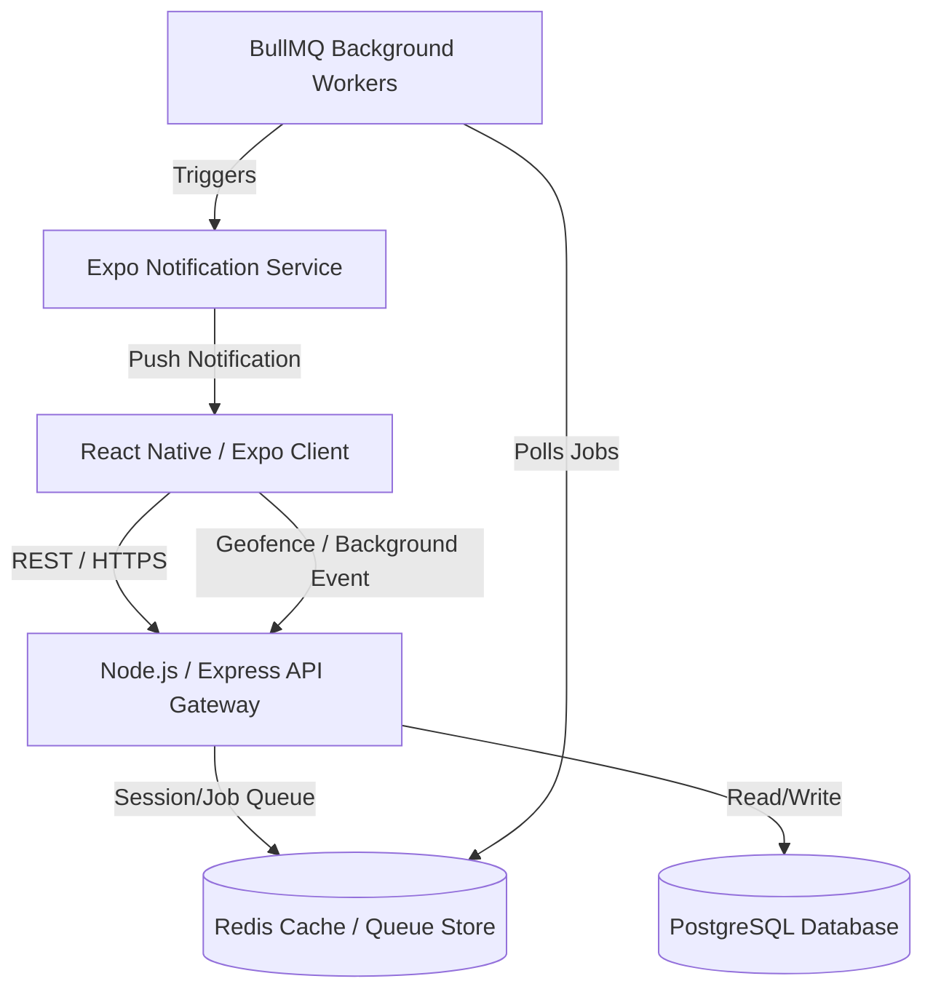
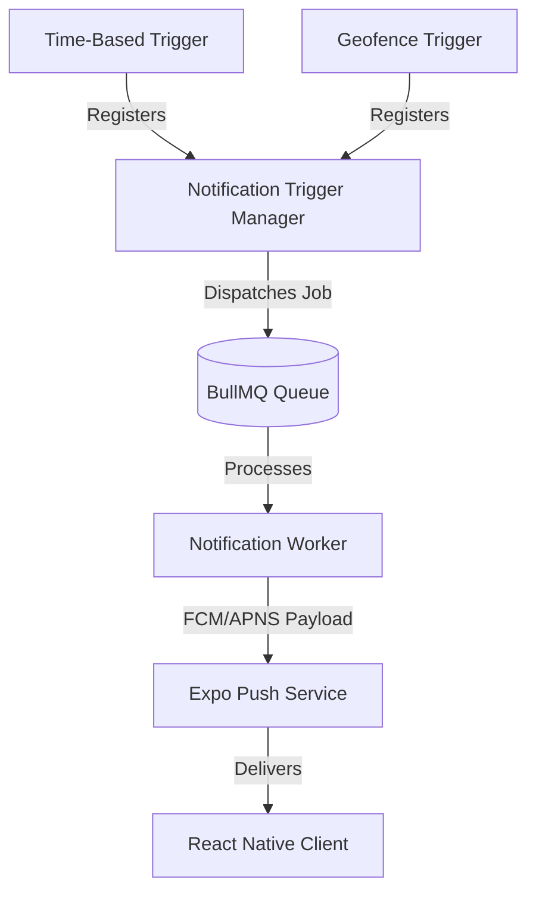

# LifeOS — System Architecture Document

This document outlines the software architecture for **LifeOS**, a personal operating system designed to reduce mental overload. It follows Clean Architecture principles, ensuring scalability, testability, and separation of concerns.

---

## 1. High-Level System Architecture

LifeOS is structured as a client-server architecture:
*   **Frontend**: React Native mobile client built with Expo, using Expo Router for navigation, Zustand for global state, and TanStack Query for server state.
*   **Backend**: A Node.js + Express + TypeScript REST API.
*   **Database & ORM**: PostgreSQL for structured data, managed using Prisma ORM.
*   **In-Memory Store & Queue**: Redis for session cache, token blacklists, and BullMQ background task processing.
*   **Push Notifications**: Expo Push Notification Service.



---

## 2. Core Architectural Philosophy: Clean Architecture

To prevent tight coupling and facilitate future feature expansion (e.g., adding AI Assistant, Graph Relations), we enforce a strict separation of concerns following **Clean Architecture**.

```
   ┌────────────────────────────────────────────────────────┐
   │                  Frameworks & Drivers                  │
   │      (Express, Postgres, Prisma, Redis, Mobile UI)     │
   │        ┌────────────────────────────────────────┐      │
   │        │        Interface Adapters              │      │
   │        │     (Controllers, Presenters)          │      │
   │        │        ┌──────────────────────┐        │      │
   │        │        │     Use Cases        │        │      │
   │        │        │  (Business Rules)    │        │      │
   │        │        │    ┌────────────┐    │        │      │
   │        │        │    │  Entities  │    │        │      │
   │        │        │    │(Domain Mod)│    │        │      │
   │        │        │    └────────────┘    │        │      │
   │        │        └──────────────────────┘        │      │
   │        └────────────────────────────────────────┘      │
   └────────────────────────────────────────────────────────┘
```

### Dependency Rule
Dependencies must flow **inwards**. Domain logic (Entities and Use Cases) must never depend on database drivers, network protocols, or UI elements. Database engines or third-party libraries (e.g., Express, Prisma) must implement interfaces defined in the domain layer.

*   **Entities (Domain Layer)**: Core business objects (e.g., `User`, `Task`, `Transaction`).
*   **Use Cases (Application Layer)**: Business workflows (e.g., `CreateTaskUseCase`, `ProcessInboxItemUseCase`).
*   **Interface Adapters (Infrastructure Layer)**: Translates data between external systems and use cases (e.g., controllers mapping HTTP requests to use cases, database repositories implementing domain repository interfaces).
*   **Frameworks & Drivers**: The actual delivery systems (Express API endpoints, PostgreSQL database connections).

---

## 3. Mobile Client Architecture

The mobile application is built using React Native and Expo, incorporating:
1.  **Routing & Navigation**: Expo Router. Leverages file-based routing to automatically handle tab bars, stacks, and modal screens, facilitating deep linking and dynamic route generation.
2.  **State Management**:
    *   **Client State**: Zustand. Lightweight, hook-based state management. Combined with `zustand/middleware` (persist) for offline storage.
    *   **Server State**: TanStack Query (React Query). Handles automatic fetching, caching, deduplication, and synchronization of network data.
3.  **UI & Styling**: NativeWind (Tailwind CSS for React Native). Ensures consistent styling using a global design system utility classes.
4.  **Forms**: React Hook Form with `zod` schema validation. Handles form state, inputs, and validation errors with minimal re-renders.

### Offline-First Strategy
To achieve the core philosophy of **"Capture first. Organize later,"** the capture interface (Brain Dump) must be instant and independent of internet availability.

*   **Local Queuing**: When offline, captures are stored locally in an offline sync queue (Zustand Persisted Store / SQLite via Expo SQLite).
*   **Background Sync**: An Expo Background Fetch task checks for network availability and pushes queued captures to the backend once online.
*   **Optimistic Updates**: TanStack Query updates local UI immediately on task toggles or edits, syncing changes asynchronously with retry policies.

---

## 4. Backend Service Architecture

The backend REST API is built with Express.js and TypeScript, organized by modules (e.g., `auth`, `tasks`, `ledger`). Each module contains:
*   **Routes**: Defines HTTP endpoints and binds controller methods.
*   **Middlewares**: Handlers for auth verification, rate limiting, and inputs validation (`zod`).
*   **Controllers**: Parses request payloads, executes use cases, and maps results to HTTP responses.
*   **Services**: Implements business use cases, remaining framework-agnostic.
*   **Repositories**: Encapsulates data access patterns. Communicates directly with Prisma ORM.

### 4.1. Transcription Layer (Brain Dump Module)
To support voice captures, the backend implements a provider-agnostic transcription engine. The Brain Dump module interacts only with a standardized `TranscriptionService` interface:

```typescript
export interface ITranscriptionService {
  transcribe(audioBuffer: Buffer, mimeType: string): Promise<string>;
}
```

*   **Pluggable Architecture**: The system uses Dependency Injection to supply the concrete implementation. If the active provider changes (e.g., from a mock processor to OpenAI Whisper, Google Speech-to-Text, Deepgram, or local Whisper), only the DI binding in the configuration changes; the rest of the application remains unchanged.
*   **Initial Mock Implementation**: For local development and testing, a `MockTranscriptionService` simulates transcribing audio by returning placeholders or utilizing simple metadata headers.
*   **Production Implementation**: The default production service is `OpenAiWhisperService`, calling the OpenAI audio API via HTTPS.

---

## 5. Authentication Flow

Authentication is stateless using **JWT (JSON Web Tokens)** with a secure, token-rotation refresh mechanism.

```
Mobile Client                       Backend Server                     Redis Store
    |                                     |                                 |
    |------- 1. Send Credentials -------->|                                 |
    |                                     |-- 2. Validate user & create JWT |
    |<------ 3. Return Tokens ------------|                                 |
    |          (Access + Refresh JWT)     |                                 |
    |                                     |                                 |
    |--- 4. Request with Access Token --->|                                 |
    |                                     |-- 5. Validate & process request |
    |<-- 6. Resource Data / OK -----------|                                 |
    |                                     |                                 |
    |--- 7. Access Token Expired (401) -->|                                 |
    |                                     |                                 |
    |--- 8. Send Refresh Token ---------->|                                 |
    |                                     |-- 9. Check if token revoked? -->|
    |                                     |<- 10. Token valid --------------|
    |                                     |-- 11. Revoke old Refresh Token -|--> Add to Blocklist
    |                                     |-- 12. Issue new Access + Refresh|
    |<-- 13. Return new Tokens -----------|                                 |
```

### Storage Security
*   **Mobile**: Access token is stored in memory. Refresh token is stored securely using `expo-secure-store`.
*   **Token Rotation**: Every time a refresh token is used, a new access/refresh token pair is generated. The old refresh token is immediately blacklisted in Redis to prevent reuse attacks.

---

## 6. Notification & Geofencing Architecture

The notification system separates the scheduling/delivery engine from the event triggers (e.g., geofencing, time-based reminders), allowing new trigger systems to be added without impacting existing code.



### 6.1. Decoupled Trigger Engine
The `NotificationTriggerManager` processes various triggers dynamically:
*   **Trigger Providers**: Any module can define a trigger class conforming to `INotificationTriggerProvider` (e.g., `GeofenceTrigger`, `TimeTrigger`, `CustomAlertTrigger`).
*   **Decoupled Geofencing**: The geofencing module simply monitors coordinate entries. When a boundary is crossed, it alerts the trigger engine, which determines which notifications to load and enqueue. The geofencing system has no knowledge of how notifications are formatted or delivered.

### 6.2. Geofencing Strategy (Mobile & Native)
*   **Expo Location API**: Mobile clients register geofences with the OS using `expo-location`. This leverages native iOS (CoreLocation) and Android (Location Services) geofencing APIs.
*   **Battery Optimization**: 
    *   Prioritizes native OS-level boundary monitoring over continuous polling.
    *   Does NOT request constant high-frequency GPS tracking. The OS wakes up the background fetch worker only when crossing boundaries.
*   **Radius Configurations**: Geofences use a default radius of **150 meters**, and are configurable in the database and UI between **50 meters** and **500 meters**.
*   **MVP Execution**: Initial release (MVP) executes triggers only on **Geofence Entry**. Exit triggers are defined in the schema but deactivated in the client code for future activation.
*   **Conditional Permission Triggers**: To respect user privacy and system resources:
    *   The app requests basic foreground location permissions on initial use if map-based views are opened.
    *   **Background Location permissions** (`ACCESS_BACKGROUND_LOCATION` / always allow) are requested **ONLY** when the user explicitly enables a location-based reminder or registers a place trigger.

