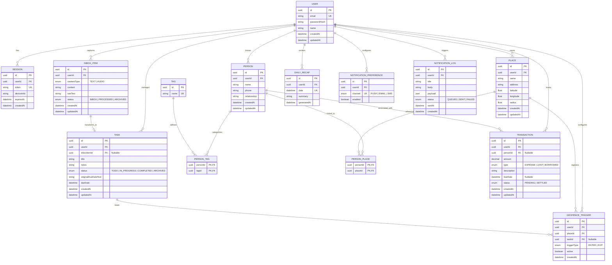

# LifeOS — Database Design Document

This document outlines the database architecture for **LifeOS**. It utilizes a normalized PostgreSQL relational database managed via Prisma ORM.

---

## 1. Database Model & ER Diagram

The schema is built to scale, utilizing explicit junction tables for many-to-many relationships (e.g., mapping People to Tags, and People to Places) and cascading deletion constraints.



---

## 2. Integrity Constraints & Cascade Rules

To prevent data anomalies, we enforce strict foreign key constraints:
*   **User Cascades**: If a user is deleted, all their personal data (`Session`, `InboxItem`, `Task`, `Place`, `Person`, `Transaction`, `DailyRecap`, `NotificationPreference`, `NotificationLog`, `GeofenceTrigger`) must undergo **Cascade Delete** to maintain complete privacy isolation and comply with GDPR/data privacy mandates.
*   **Inbox to Task**: When creating a `Task` from an `InboxItem`, the link is preserved via `inboxItemId`. If the original `InboxItem` is deleted, the task is **not** deleted; instead, the `inboxItemId` is set to `NULL` (`onDelete: SetNull`).
*   **Transaction to Person**: If a transaction is linked to a person, deleting that person should not delete the transaction. The transaction remains, but the relation is broken (`personId` set to `NULL`).
*   **Junction Tables**: For `PersonTag` and `PersonPlace`, deleting a `Person`, `Tag`, or `Place` cascades and deletes the junction row.

---

## 3. Database Indexes

To guarantee sub-second queries as the dataset grows, we establish the following indexes:
*   `InboxItem`: Index on `(userId, status, createdAt)` to optimize fetch speeds for the unprocessed Inbox list.
*   `Task`: Composite index on `(userId, status, dueDate)` for rapid queries powering the Day View and scheduler tasks.
*   `DailyRecap`: Unique composite index on `(userId, date)` ensuring only one recap per user-day exists, facilitating instant queries.
*   `GeofenceTrigger`: Index on `(userId, placeId, active)` to quickly identify active geofences for background location processors.
*   `Transaction`: Composite index on `(userId, type, status)` for fast ledger computations (e.g., sum of money owed).

---

## 4. Prisma Schema Design

This is the draft configuration for `prisma/schema.prisma`. It represents the database schema and uses standard Prisma configurations.

```prisma
datasource db {
  provider = "postgresql"
  url      = env("DATABASE_URL")
}

generator client {
  provider = "prisma-client-js"
}

enum ContentType {
  TEXT
  AUDIO
}

enum InboxStatus {
  INBOX
  PROCESSED
  ARCHIVED
}

enum TaskStatus {
  TODO
  IN_PROGRESS
  COMPLETED
  ARCHIVED
}

enum TransactionType {
  EXPENSE
  LENT
  BORROWED
}

enum TransactionStatus {
  PENDING
  SETTLED
}

enum NotificationChannel {
  PUSH
  EMAIL
  SMS
}

enum NotificationStatus {
  QUEUED
  SENT
  FAILED
}

enum GeofenceTriggerType {
  ENTER
  EXIT
}

model User {
  id                      String                   @id @default(uuid()) @db.Uuid
  email                   String                   @unique
  passwordHash            String
  name                    String
  createdAt               DateTime                 @default(now())
  updatedAt               DateTime                 @updatedAt
  sessions                Session[]
  inboxItems              InboxItem[]
  tasks                   Task[]
  places                  Place[]
  people                  Person[]
  transactions            Transaction[]
  dailyRecaps             DailyRecap[]
  notificationPreferences NotificationPreference[]
  notificationLogs        NotificationLog[]
  geofenceTriggers        GeofenceTrigger[]

  @@map("users")
}

model Session {
  id         String   @id @default(uuid()) @db.Uuid
  userId     String   @db.Uuid
  token      String   @unique
  deviceInfo String?
  expiresAt  DateTime
  createdAt  DateTime @default(now())
  user       User     @relation(fields: [userId], references: [id], onDelete: Cascade)

  @@map("sessions")
}

model InboxItem {
  id          String      @id @default(uuid()) @db.Uuid
  userId      String      @db.Uuid
  contentType ContentType
  content     String      // Text content or Audio file URL
  rawText     String?     // Audio transcription text
  status      InboxStatus @default(INBOX)
  createdAt   DateTime    @default(now())
  updatedAt   DateTime    @updatedAt
  user        User        @relation(fields: [userId], references: [id], onDelete: Cascade)
  task        Task?

  @@index([userId, status, createdAt])
  @@map("inbox_items")
}

model Task {
  id                  String            @id @default(uuid()) @db.Uuid
  userId              String            @db.Uuid
  inboxItemId         String?           @unique @db.Uuid
  title               String
  notes               String?
  status              TaskStatus        @default(TODO)
  originalDueDateText String?
  dueDate             DateTime?
  createdAt           DateTime          @default(now())
  updatedAt           DateTime          @updatedAt
  user                User              @relation(fields: [userId], references: [id], onDelete: Cascade)
  inboxItem           InboxItem?        @relation(fields: [inboxItemId], references: [id], onDelete: SetNull)
  geofenceTriggers    GeofenceTrigger[]

  @@index([userId, status, dueDate])
  @@map("tasks")
}

model Place {
  id           String        @id @default(uuid()) @db.Uuid
  userId       String        @db.Uuid
  name         String
  address      String?
  latitude     Float
  longitude    Float
  radius       Float         @default(150.0) // Default radius in meters (configurable 50-500m)
  createdAt    DateTime      @default(now())
  updatedAt    DateTime      @updatedAt
  user         User          @relation(fields: [userId], references: [id], onDelete: Cascade)
  linkedPeople PersonPlace[]
  geofences    GeofenceTrigger[]

  @@index([userId])
  @@map("places")
}

model Person {
  id           String        @id @default(uuid()) @db.Uuid
  userId       String        @db.Uuid
  name         String
  phone        String?
  relationship String?
  createdAt    DateTime      @default(now())
  updatedAt    DateTime      @updatedAt
  user         User          @relation(fields: [userId], references: [id], onDelete: Cascade)
  tags         PersonTag[]
  linkedPlaces PersonPlace[]
  transactions Transaction[]

  @@index([userId])
  @@map("people")
}

model Tag {
  id     String      @id @default(uuid()) @db.Uuid
  name   String      @unique
  people PersonTag[]

  @@map("tags")
}

model PersonTag {
  personId String @db.Uuid
  tagId    String @db.Uuid
  person   Person @relation(fields: [personId], references: [id], onDelete: Cascade)
  tag      Tag    @relation(fields: [tagId], references: [id], onDelete: Cascade)

  @@id([personId, tagId])
  @@map("person_tags")
}

model PersonPlace {
  personId String @db.Uuid
  placeId  String @db.Uuid
  person   Person @relation(fields: [personId], references: [id], onDelete: Cascade)
  place    Place  @relation(fields: [placeId], references: [id], onDelete: Cascade)

  @@id([personId, placeId])
  @@map("person_places")
}

model Transaction {
  id          String            @id @default(uuid()) @db.Uuid
  userId      String            @db.Uuid
  personId    String?           @db.Uuid
  amount      Decimal           @db.Decimal(12, 2)
  type        TransactionType
  description String
  dueDate     DateTime?
  status      TransactionStatus @default(PENDING)
  createdAt   DateTime          @default(now())
  updatedAt   DateTime          @updatedAt
  user        User              @relation(fields: [userId], references: [id], onDelete: Cascade)
  person      Person?           @relation(fields: [personId], references: [id], onDelete: SetNull)

  @@index([userId, type, status])
  @@map("transactions")
}

model DailyRecap {
  id          String   @id @default(uuid()) @db.Uuid
  userId      String   @db.Uuid
  date        DateTime @db.Date
  summary     String
  generatedAt DateTime @default(now())
  user        User     @relation(fields: [userId], references: [id], onDelete: Cascade)

  @@unique([userId, date])
  @@index([userId, date])
  @@map("daily_recaps")
}

model NotificationPreference {
  id        String              @id @default(uuid()) @db.Uuid
  userId    String              @db.Uuid
  channel   NotificationChannel
  enabled   Boolean             @default(true)
  user      User                @relation(fields: [userId], references: [id], onDelete: Cascade)

  @@unique([userId, channel])
  @@map("notification_preferences")
}

model NotificationLog {
  id        String             @id @default(uuid()) @db.Uuid
  userId    String             @db.Uuid
  title     String
  body      String
  payload   Json?
  status    NotificationStatus @default(QUEUED)
  sentAt    DateTime?
  createdAt DateTime           @default(now())
  user      User               @relation(fields: [userId], references: [id], onDelete: Cascade)

  @@index([userId, status])
  @@map("notification_logs")
}

model GeofenceTrigger {
  id          String              @id @default(uuid()) @db.Uuid
  userId      String              @db.Uuid
  placeId     String              @db.Uuid
  taskId      String?             @db.Uuid
  triggerType GeofenceTriggerType
  active      Boolean             @default(true)
  createdAt   DateTime            @default(now())
  user        User                @relation(fields: [userId], references: [id], onDelete: Cascade)
  place       Place               @relation(fields: [placeId], references: [id], onDelete: Cascade)
  task        Task?               @relation(fields: [taskId], references: [id], onDelete: Cascade)

  @@index([userId, placeId, active])
  @@map("geofence_triggers")
}
```
